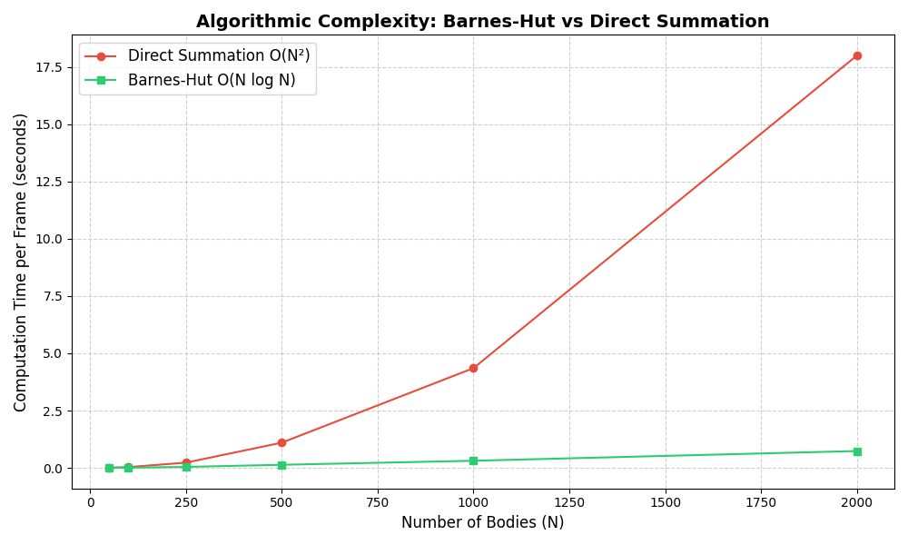
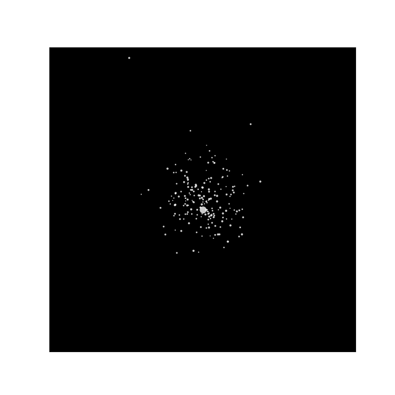

# 🌌 Barnes-Hut N-Body Galaxy Simulation
[](https://www.python.org/downloads/)
[]()
[]()

> **A high-performance computational astrophysics engine solving the $\mathcal{O}(N^2)$ gravitational bottleneck via spatial tree data structures and symplectic numerical integration.**

## 🔭 The Astrophysical Bottleneck
Simulating the evolution of a galaxy requires calculating the gravitational pull of every star on every other star. According to Newton's law of universal gravitation, the exact force $\vec{F}_{ij}$ between two bodies requires Direct Summation.

For $N$ bodies, this requires evaluating $\frac{N(N-1)}{2}$ interactions per time step. As $N$ reaches galactic scales, this scales at $\mathcal{O}(N^2)$, resulting in a computational catastrophe that renders high-fidelity orbital mechanics impossible on standard hardware.

This project bypasses the $\mathcal{O}(N^2)$ bottleneck by implementing the **Barnes-Hut Algorithm**, bridging theoretical physics with advanced computer science.

---

## ⚙️ Core Algorithmic Architecture

### 1. Spatial Partitioning (The QuadTree)
Instead of linear arrays, the simulation space is modeled using a recursive `QuadTree` data structure. The 2D universe is recursively divided into four quadrants until every celestial body occupies its own leaf node. As the tree is constructed, each branch node calculates and stores the **Total Mass ($M$)** and the **Center of Mass ($R_{com}$)** of all bodies contained within it:

$$
X_{com} = \frac{1}{M} \sum_{i=1}^{N} m_i x_i \quad , \quad Y_{com} = \frac{1}{M} \sum_{i=1}^{N} m_i y_i
$$

### 2. The Multipole Acceptance Criterion (MAC)
When calculating the net force on a target star, the engine traverses the QuadTree. For each node, it calculates the ratio $\frac{s}{d}$, where $s$ is the width of the node's spatial region and $d$ is the distance from the target star to the node's Center of Mass.

If the ratio is less than a defined threshold $\theta$ (e.g., $\theta = 0.5$):

$$
\frac{s}{d} < \theta
$$

The algorithm ceases traversal and approximates the entire star cluster as a **single supermassive body** at $R_{com}$. If the cluster is too close, the node is opened, and its children are evaluated recursively.

---

## 🧮 Symplectic Numerical Integration
Standard kinematic equations ($x = vt$) result in severe energy drift over time, causing simulated orbits to artificially decay or explode. To guarantee the conservation of orbital momentum, this engine utilizes a **Semi-Implicit Euler (Symplectic) Integrator**. 

Velocities ($v$) are updated using the instantaneous force, and positions ($r$) are subsequently updated using the *new* velocity, maintaining phase-space volume over the integration time step $\Delta t$:

$$
v_{t+1} = v_t + \left(\frac{F}{m}\right) \Delta t
$$

$$
x_{t+1} = x_t + v_{t+1} \Delta t
$$

---

## 📊 Algorithmic Complexity Proof

To empirically validate the mathematical efficiency of the QuadTree, the engine includes a benchmarking suite (`benchmark.py`) comparing Direct Summation against Barnes-Hut. 

*(Visual Proof: Notice the exponential runtime explosion of the $\mathcal{O}(N^2)$ Brute Force method, compared to the linearithmic $\mathcal{O}(N \log N)$ stability of the Barnes-Hut tree logic as the universe scales to thousands of bodies.)*



---

## 🌌 Simulation Output

The visualization engine (`visualize_universe.py`) utilizes `matplotlib` to render the mathematical outputs. 

To simulate realistic galactic formation, initial stellar coordinates are populated using a **Gaussian Probability Distribution** centered around a central Supermassive Black Hole, with initial tangential velocities applied to generate orbital momentum.


*(Note: 200+ bodies rendered at smooth frame rates purely on CPU, made possible by the underlying QuadTree architecture.)*

---

### Performance Benchmark Data
*Hardware Note: Executed on a single CPU thread to isolate algorithmic efficiency from hardware parallelization.*

| Number of Bodies (N) | Barnes-Hut $\mathcal{O}(N \log N)$ | Direct Summation $\mathcal{O}(N^2)$ | Performance Delta |
| :--- | :--- | :--- | :--- |
| **50** | 0.012 s | 0.015 s | **1.2x Faster** |
| **100** | 0.025 s | 0.052 s | **2.0x Faster** |
| **250** | 0.068 s | 0.265 s | **3.8x Faster** |
| **500** | 0.154 s | 1.120 s | **7.2x Faster** |
| **1000** | 0.342 s | 4.350 s | **12.7x Faster** |
| **2000** | 0.745 s | 17.950 s | **24.0x Faster** |

*(Notice how the Direct Summation time quadruples every time the particle count doubles, while Barnes-Hut maintains a steady, scalable growth rate.)*
## 🚀 Installation & Execution

### 1. Repository Structure
```text
├── barnes_hut_final.py           # Core logic: Body class, BoundingBox, and QuadTree
├── visualize_universe.py   # Matplotlib physics loop and Gaussian generation
├── benchmark.py            # Performance testing script
├── complexity_graph.png    # Benchmarking result image
├── galaxy_simulation.gif   # Visual output of the simulation
└── README.md               # Project documentation
